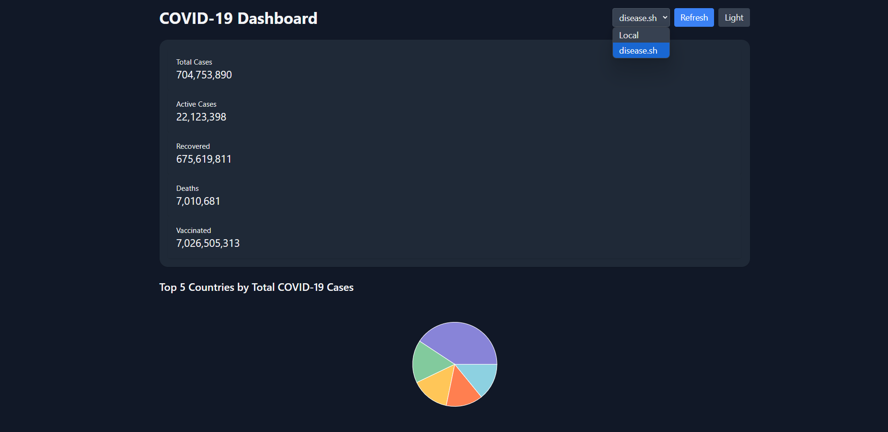
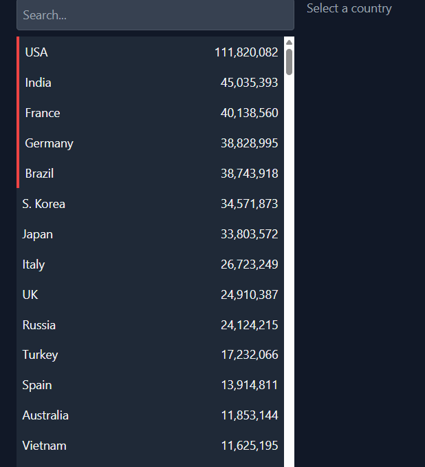
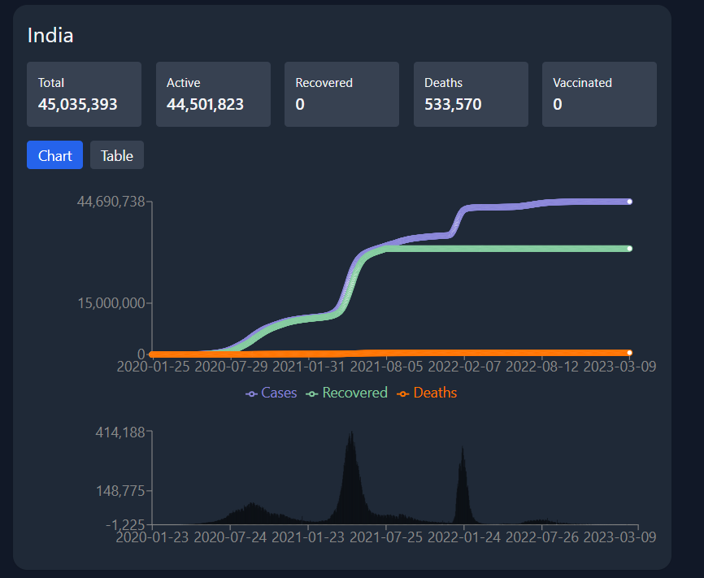
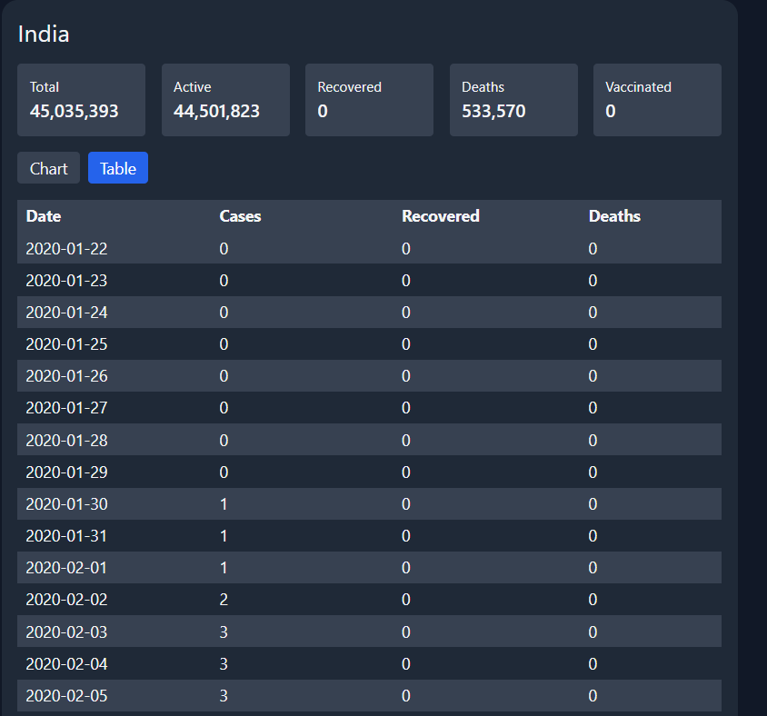
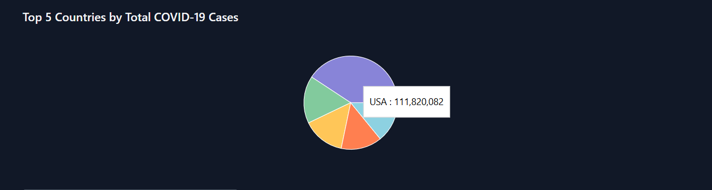

# 🦠 COVID‑19 Dashboard

An interactive full‑stack COVID‑19 dashboard displaying global and country-wise data, with rich visualizations, dark mode, auto-refresh, and real-time API switching.

Live Demo:
- 🌐 Frontend: https://covid-19-dashboard-ashy.vercel.app/  
- 🔗 Backend: https://covid-19-dashboard-kadv.onrender.com/api

---

## 🚀 Features

- **Global Summary**
  - Total Cases  
  - Active Cases  
  - Recovered  
  - Deaths  
  - Vaccinated  

- **Top 5 Pie Chart**
  - Visualize each of the five worst‑hit countries’ share of total cases  

- **Country List**
  - Searchable & filterable by name  
  - Sorted by total cases  
  - Top 5 countries highlighted  

- **Country Detail View**
  - Top‑line stats cards (Total, Active, Recovered, Deaths, Vaccinated)  
  - Toggle between Chart and Table views  
  - Cumulative Line Chart (cases, recoveries, deaths)  
  - Daily New Cases Bar Chart  

- **Dark Mode**
  - Defaults to dark  
  - Toggleable via button  
  - Preference persists in `localStorage`  

- **Auto‑Refresh**
  - Manual “Refresh” button  
  - Auto‑poll every 5 minutes  

- **API‑Source Switcher**
  - Local JSON backend  
  - https://disease.sh public API  

---

## ⚙️ Setup Instructions

### 1. Clone the repository

```bash
git clone https://github.com/<your-username>/covid-dashboard.git
cd covid-dashboard
```

---

### 2. Backend (Express + sample data)

```bash
cd backend
npm install
npm run dev
```

> API runs at: `http://localhost:5000/api`

---

### 3. Frontend (React + Tailwind + Recharts)

```bash
cd ../frontend
npm install
npm start
```

> App runs at: `http://localhost:3000` (or `http://localhost:5173` if using Vite)

> Make sure `.env` file contains:

```
REACT_APP_API_URL=http://localhost:5000/api
```

---

## 🛠️ Tech Stack

- **Frontend**
  - React  
  - Recharts  
  - Axios  
  - Tailwind CSS  

- **Backend**
  - Node.js  
  - Express.js  
  - Local JSON file  
  - Node-cache for basic caching  

- **Deployment**
  - Frontend: Vercel  
  - Backend: Render  

---

## 📸 Screenshots

### 🌍 Dashboard Home



### 📋 Country List + Search



### 📈 Detail View – Charts



### 🧾 Detail View – Table



### 🍰 Pie Chart – Top 5 Countries



---

## 📦 Deliverables Summary

- ✅ Fully functional dashboard (global + per-country)
- ✅ Switchable data source (local API or real-time API)
- ✅ Responsive & dark-mode ready UI
- ✅ Accurate chart visualizations
- ✅ Hosted links + documented setup
- ✅ Screenshots included

---

## 📝 License

This project is built for educational/demonstration purposes. Attribution to disease.sh API for real-time data.

---

